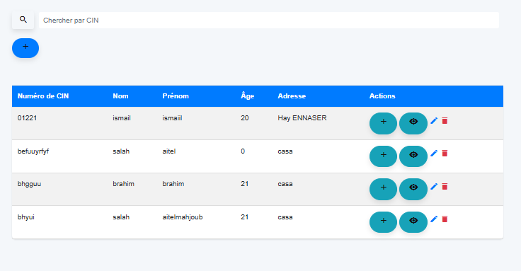
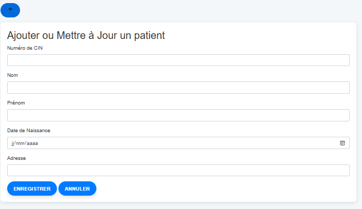
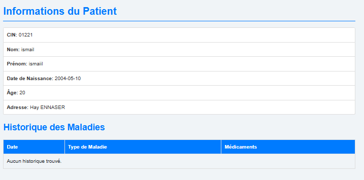

# Patient Management System 🏥

A comprehensive web application for managing patient medical records with disease tracking and treatment history.

## Project Overview 📋
This system provides healthcare professionals with an intuitive platform to:
- Digitally manage patient profiles with CIN-based identification
- Track medical history including diagnoses and prescribed medications
- Calculate patient ages automatically from birthdates
- Maintain responsive records accessible via web browsers
- Implement CRUD operations with Firebase real-time database

  ✅ Add/Edit patient profiles  
  ✅ CIN-based search system  
  ✅ Auto-age calculation from birthdate
- **Medical Tracking**  
  📆 Disease diagnosis history  
  💊 Medication management  
  📅 Automatic date-stamping
- **User Interface**  
  🖥️ Interactive tables with CRUD operations  
  🔍 Instant search functionality  
  📱 Mobile-responsive design

## Screenshots 📸
| Patient List              | Add Patient Form            | Medical History            |
|---------------------------|-----------------------------|-----------------------------|
|  |  |  |


## Contributors 👥
- **Salaheddine AIT EL MAHJOUB**  
  [](https://github.com/saitelmahjoub)


## License 📄
[](https://opensource.org/licenses/MIT)  
See [LICENSE](LICENSE) for details.

## Acknowledgments 🙏
- EMSI for academic support.
- Sofia Lemssaddak for project guidance.
- Firebase and Bootstrap teams for open-source tools.
## Tech Stack 💻
- **Frontend Framework**  
  
- **Database & Auth**  
  
- **UI Components**  
  

## Installation 🚀
1. Clone repository:
```bash
git clone https://github.com/your-username/Gestion-des-patients.github.io.git
